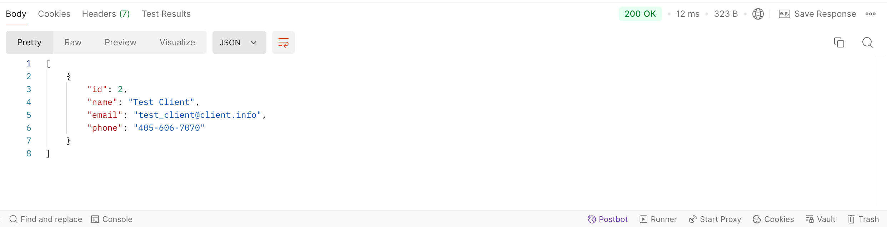
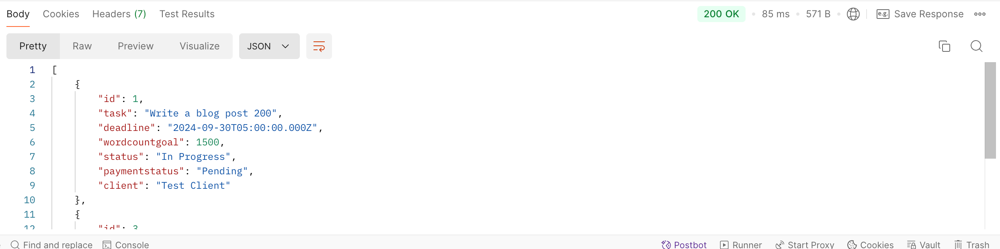

# Fwrite
Fwrite is an API programmed with Node, designed as a project-management tool for
freelance writers.
## Project Overview
Fwrite is a CRM API that gives freelance writers a suite of tools to manage 
their business. I started this project when I first started learning to 
develop back-end applications with Node. With this in mind, the app is 
currently very limited in what it can do. However, I am continuing to work on it
as I upgrade my skills.

The following technologies were used in the creation of this project:

* Visual Studio Code
* Webstorm
* Node
* Git
* PostgresSQL
* Postman
## Development
When I started learning to program back-end applications with
Node.js, I designed the project because I wanted a practical
way to practice and develop my back-end development skills.
With my background as a freelance editor and writer, I felt
I had some excellent insight that would allow me to create
software that had everything a freelancer might need to 
manage their writing or editing clients.

At the building block of this API is the passion to build
a web application that gives freelance writers all the 
tools they need in one location, rather than frankensteining
a bunch of different tools that might only have a few 
features.

This project is still currently under development because it
currently only has the ability to add clients to the 
database and tasks that need to be done for that client. I 
have plans to add many more useful functions.
## Solution Design
I didn't originally begin this project with a solid design 
of all the features I wanted to include. My plan was to 
start with a very simple MVP—which is the functionality to 
add all the freelancer's clients—and build on that piece 
a little bit at a time. Then, once I am happy with all the 
tools I put together, my plan is to add user login so I can 
put it online and host it for others to use.
## Upcoming Plans
I am continuing to develop this API as I build on my Node.js 
skills. My end goal is to have a fully functioning web 
application with user login capabilities.
## Testing
### Postman Testing for GET (Clients)

### Postman Testing for GET (Tasks)
